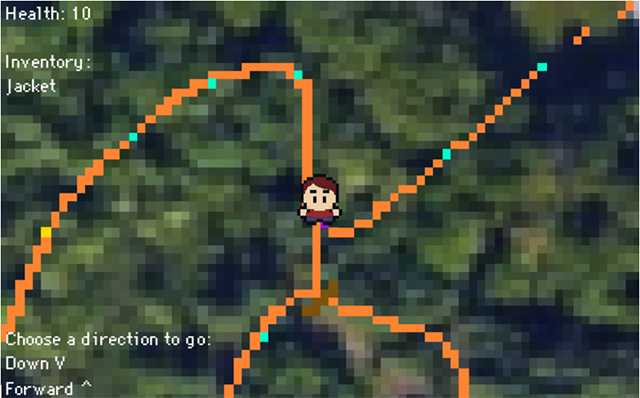
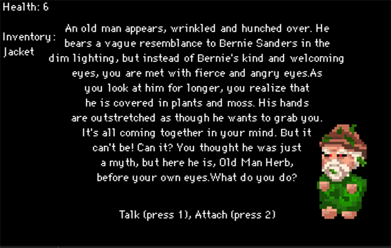
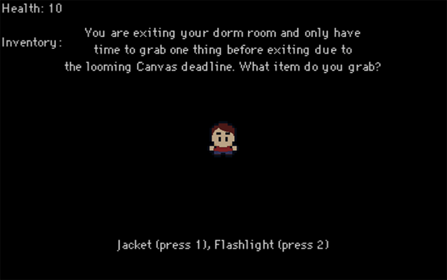

# View Our VIDEO by clicking on the image:

# Overview

Parcel B: Beetle Quest is a text-based choose-your-own adventure game themed
around common experiences as a first year at Olin College of Engineering.

Players move through a map trying to find a click beetle, encountering various
strange creatures, creations, and other oddities in Parcel B (a small forest
next to Olin's campus) as they go. Each decision the player makes pushes them
farther along a unique path. Will you be able to defeat Old Man Herb and find
the click beetle or will you go missing in Parcel B? Find out when you play
Parcel B: Beetle Quest.

Parcel B: Beetle Quest is:
* Unique each time you play, with 14 unique endings
* Close to home for Olin students in theme
* Compatible with any device that has Python
* Open-source and easy to add your own theme and storyline

## Technical Information

Parcel B: Beetle Quest is written to be cross-platform using Python and the
pygame Python library. This library provides all the necessary features related
to making the game window, displaying text, character, and events, and getting
keyboard input from the user.

All game data is stores in JSON files containing information about map locations
and images, event sequences and outcomes, and win/loss outcomes of the game.
This structure allows for easily swapping out event and map datafiles (along
with their referenced images) in order to add new content to the game or
change the theme and events completely.

## Installation Instructions

Download, install dependencies, and run! Parcel B: Beetle Quest is easy to run
on any system that already has Python.
1. Clone the repository to your computer from
[GitHub](https://github.com/olincollege/parcel-b-beetle-quest)
2. Install all game  dependencies by running `pip install -r requirements.txt`
from the game directory.
3. Run the game by running `python main.py` from the game directory.

More information can be found in the
[project's readme](https://github.com/olincollege/parcel-b-beetle-quest).

## Project Contributors
Parcel B: Beetle Quest was written by Carter Harris, Mark Belanger, and Elin
O'Neill as part of the Software Design course at Olin College of Engineering in
Spring of 2023.
